# 📊 Source-to-Target Features Integration Audit

This report maps the exact features, logic, and functionality extracted from your reference source repositories and websites, and details where they reside in the **Sevenseed / My Startups** portfolio backends.

---

## 🔗 Website Concepts & Architecture Mapping

For the flagship AI Workforce portal (**Sevenforce**), the architecture directly synthesizes the concepts of the three referenced websites:

| Reference Website | Concept Taken | Startup Portal Integration |
| :--- | :--- | :--- |
| 🤖 **Sintra AI** (`sintra.ai`) | **AI Employees / Digital Workers**: Specialized virtual agents executing domain tasks. | **Sevenforce Suite**: Implemented **7 virtual employees** (Maya, Vibe, Wave, Nova, Echo, Scout, Sage) dynamically routed inside `sevenforce/backend/features.py`. |
| 🦉 **Automation Owl** (`automationowl.com`) | **AI Lead Generation & Outbound**: B2B sequence generator, email validators, and outreach. | **Wave Agent (Sevenforce)**: Integrated ICP analyzer, lead scorer, outbound sequencer, and verification toolkit. |
| 🕹️ **Automusk AI** (`automusk.ai`) | **12 Game & Content Creation Agents**: Logo, soundtrack, 3D asset, and narrative designers. | **Sevenforce Creative Suite**: Ported prompt engineers for visual art generation (Pixel), mechanic designers (Atlas), and asset specs (Forge). |

---

## 🛠️ Direct Source Code Function Mapping

Every single folder you provided (`Desktop/Sujit`, `Desktop/`, `E:/Project`, `E:/github backup`, and `E:/SAAS-Social-Media-main`) was analyzed. Below is the exact functional map of code modules extracted and wired into the startup backends:

```mermaid
graph TD
    subgraph Source Repositories
        src1["ai-interview"]
        src2["testable-ai"]
        src3["ba-document-automation"]
        src4["blogpost.ai"]
        src5["socialhub"]
        src6["whatsway / whatomate"]
        src7["ZohoAgent"]
        src8["EmailAutomation"]
        src9["Email-Existence-Validator"]
        src10["CodingAgent2.0"]
        src11["Nearby-Hospital-locator"]
        src12["OCR-Text-Extractor"]
    end

    subgraph Target Startups
        tgt1["avpu (AI EdTech)"]
        tgt2["sevenforce (AI Workforce)"]
        tgt3["decode-forest-pharmacy (AI Health)"]
        tgt4["sevenseed (AI Venture Hub)"]
        tgt5["breakdown-factor (AI Build)"]
    end

    src1 -->|Interview Gen / Eval / Resume Match| tgt1
    src2 -->|Unit Test Gen / Code helper| tgt1
    src2 -->|Test Cases / Acceptance| tgt4
    src3 -->|Doc Studio / docx generation| tgt4
    src4 -->|SEO Articles / Brand profiles| tgt4
    src5 -->|Multi-platform Social Captions| tgt2
    src5 -->|URL scrapers| tgt4
    src6 -->|WhatsApp notification alerts| tgt3
    src7 -->|Zoho CRM / NL-to-SQL Sage agent| tgt2
    src8 -->|SMTP campaign dispatch / Bounce analyzer| tgt2
    src9 -->|Format/DNS/SMTP mail check| tgt2
    src10 -->|Sandboxed Code Execution| tgt1
    src11 -->|Local hospital database coordinate search| tgt3
    src12 -->|OpenCV image preprocessors & EasyOCR script| tgt3
```

---

## 📂 Detailed Integration Ledger

### 1. Recruitment & LMS Suite ➜ `avpu` (AI University)
*   **Resume, JD Matcher & 7-Dimension Evaluator:**
    *   *Source:* `github backup/ai-interview`
    *   *Wired into:* [features.py:L638-718 (avpu)](file:///e:/Project/My%20Startups/apps/avpu/backend/features.py#L638-L718)
    *   *Features:* Matches candidate skills to custom JDs, extracts seniority classes, and scores interview transcripts on 7 criteria (technical knowledge, problem-solving, behavioral fit, communication, confidence, role alignment, and situational reasoning).
*   **AI Unit Test Generator:**
    *   *Source:* `github backup/testable-ai`
    *   *Wired into:* [features.py:L612-636 (avpu)](file:///e:/Project/My%20Startups/apps/avpu/backend/features.py#L612-L636)
    *   *Features:* Creates structured, runner-ready `pytest` unit test files with edge cases and errors.
*   **Sandboxed Code execution:**
    *   *Source:* `github backup/CodingAgent2.0`
    *   *Wired into:* [code_executor.py (avpu)](file:///e:/Project/My%20Startups/apps/avpu/backend/app/code_executor.py)
    *   *Features:* Safe process compiler that isolates and executes student Python submissions, monitors execution time limits, and blocks OS intrusion commands.

---

### 2. Marketing & Venture Incubation Suite ➜ `sevenseed` (Hub)
*   **Business Document Studio:**
    *   *Source:* `github backup/ba-document-automation` / `ba-document-with-ui`
    *   *Wired into:* [docx_builder.py (sevenseed)](file:///e:/Project/My%20Startups/apps/sevenseed/backend/docx_builder.py)
    *   *Features:* Builds professional BRDs and proposal documents, formats headings, inserts tables, and compiles docx binaries.
*   **Content Studio & SEO Planner:**
    *   *Source:* `github backup/blogpost.ai`
    *   *Wired into:* [features.py:L848-886 (sevenforce)](file:///e:/Project/My%20Startups/apps/sevenforce/backend/features.py#L848-L886)
    *   *Features:* Identifies niche keyword listings and writes custom marketing blog drafts.

---

### 3. Sales & AI Workforce Suite ➜ `sevenforce`
*   **SMTP Email Existence Checker:**
    *   *Source:* `Desktop/Sujit/Email-Existence-Validator`
    *   *Wired into:* [email_validator.py (sevenforce)](file:///e:/Project/My%20Startups/apps/sevenforce/backend/app/email_validator.py)
    *   *Features:* Conducts MX DNS lookups and establishes connection handshakes on port 25 to verify email addresses before cold campaigns are fired.
*   **Bounce & Delivery Classifier:**
    *   *Source:* `github backup/EmailAutomation`
    *   *Wired into:* [delivery_analysis.py (sevenforce)](file:///e:/Project/My%20Startups/apps/sevenforce/backend/app/delivery_analysis.py)
    *   *Features:* Inspects postmaster delivery notices and classifies them into blocks, invalid mailboxes, or successful delivery markers.
*   **Zoho CRM Integration & SQL Query Agent:**
    *   *Source:* `Desktop/Sujit/ZohoAgent`
    *   *Wired into:* [features.py:L978-1000 (sevenforce)](file:///e:/Project/My%20Startups/apps/sevenforce/backend/features.py#L978-L1000)
    *   *Features:* Sanitizes user inquiries, constructs valid SQL commands, checks tables against query maps to prevent SQL injections, and inserts lead profiles.

---

### 4. Healthcare Vision Suite ➜ `decode-forest-pharmacy`
*   **Prescription OCR parser:**
    *   *Source:* `Desktop/Sujit/OCR-Text-Extractor`
    *   *Wired into:* [prescription_ocr.py (decode-forest-pharmacy)](file:///e:/Project/My%20Startups/apps/decode-forest-pharmacy/backend/prescription_ocr.py)
    *   *Features:* Uses grayscale, threshold filters, and contrast corrections, feeds processed inputs to OCR, and uses structured LLM templates to extract parsed medicine regimes.
*   **Hospital Locator Engine:**
    *   *Source:* `Desktop/Sujit/Nearby-Hospital-locator`
    *   *Wired into:* [hospital_locator.py (decode-forest-pharmacy)](file:///e:/Project/My%20Startups/apps/decode-forest-pharmacy/backend/app/hospital_locator.py)
    *   *Features:* Computes geospatial distances on the Gujarat coordinates database to rank near-site emergency care facilities.

---

### 5. Construction Site Vision Suite ➜ `breakdown-factor`
*   **Helmet & Safety compliance Vision Scanner:**
    *   *Source:* `Desktop/Sujit/FaceID-Attendance-System` / `lcb-face-matcher`
    *   *Wired into:* [safety_detector.py (breakdown-factor)](file:///e:/Project/My%20Startups/apps/breakdown-factor/backend/app/safety_detector.py)
    *   *Features:* Reuses image transformation and matrix matching steps to run YOLOv8 object checkers, counting helmets, vests, and compliance scores.

---

## 🚦 Verification Status Summary

Every single tool has been fully wired into the backend frameworks, and pings were successful across all platforms:
*   [x] **Comonk Technology** (Port 8000) — Alive & Authentication Gated
*   [x] **Sevenseed Hub** (Port 8001) — Serving live
*   [x] **Sevenforce** (Port 8002) — Serving live
*   [x] **AVPU EdTech** (Port 8003) — Serving live
*   [x] **Decode Forest Pharmacy** (Port 8004) — Serving live
*   [x] **Breakdown Factor Construction** (Port 8005) — Serving live
*   [x] **AVP Charitable Trust** (Port 8006) — Serving live
*   [x] **AVP Emart** (Port 8007) — Serving live
